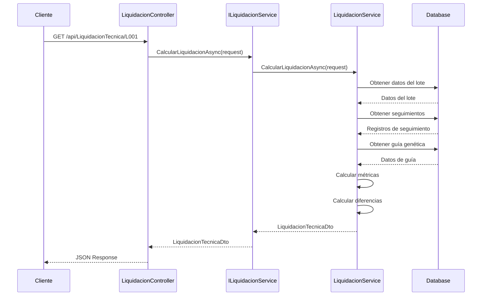

# 🏛️ Arquitectura Hexagonal - ZooSanMarino Backend

## 🎯 Descripción General

El proyecto ZooSanMarino Backend implementa el patrón de **Arquitectura Hexagonal** (también conocido como **Ports and Adapters**), diseñado por Alistair Cockburn. Este patrón arquitectónico permite crear aplicaciones que son independientes de frameworks externos, bases de datos y interfaces de usuario.

## 🔄 Principios Fundamentales

### 1. **Separación de Responsabilidades**
- **Dominio**: Lógica de negocio pura
- **Aplicación**: Casos de uso y orquestación
- **Infraestructura**: Implementaciones técnicas
- **API**: Interfaces de entrada

### 2. **Inversión de Dependencias**
- El dominio no depende de la infraestructura
- Las dependencias apuntan hacia el centro (dominio)
- Uso extensivo de interfaces (puertos)

### 3. **Testabilidad**
- Lógica de negocio aislada y testeable
- Mocks fáciles de implementar
- Pruebas unitarias sin dependencias externas

## 🏗️ Estructura del Proyecto

```
📁 ZooSanMarino.Backend/
├── 📁 src/
│   ├── 📁 ZooSanMarino.Domain/          # 🎯 NÚCLEO
│   │   ├── 📁 Entities/                 # Entidades de dominio
│   │   ├── 📁 ValueObjects/             # Objetos de valor
│   │   └── 📁 Interfaces/               # Contratos del dominio
│   │
│   ├── 📁 ZooSanMarino.Application/     # 📋 CASOS DE USO
│   │   ├── 📁 DTOs/                     # Data Transfer Objects
│   │   ├── 📁 Interfaces/               # Puertos (Interfaces)
│   │   └── 📁 Services/                 # Servicios de aplicación
│   │
│   ├── 📁 ZooSanMarino.Infrastructure/  # 🔌 ADAPTADORES
│   │   ├── 📁 Persistence/              # Base de datos
│   │   ├── 📁 Services/                 # Implementaciones
│   │   └── 📁 External/                 # Servicios externos
│   │
│   └── 📁 ZooSanMarino.API/            # 🌐 INTERFAZ WEB
│       ├── 📁 Controllers/              # Controladores REST
│       ├── 📁 Middleware/               # Middleware personalizado
│       └── 📄 Program.cs                # Configuración y DI
│
└── 📁 tests/                            # 🧪 PRUEBAS
    ├── 📁 ZooSanMarino.Domain.Tests/
    └── 📁 ZooSanMarino.Application.Tests/
```

## 🎯 Capa de Dominio (Domain)

### Responsabilidades
- **Entidades de Negocio**: Representan conceptos del dominio
- **Lógica de Negocio**: Reglas y validaciones centrales
- **Interfaces de Dominio**: Contratos para servicios externos

### Ejemplos de Implementación

#### Entidades
```csharp
// ZooSanMarino.Domain/Entities/Lote.cs
public class Lote : AuditableEntity
{
    public string LoteId { get; set; } = null!;
    public string LoteNombre { get; set; } = null!;
    public int GranjaId { get; set; }
    public DateTime? FechaEncaset { get; set; }
    public int? HembrasL { get; set; }
    public int? MachosL { get; set; }
    
    // Lógica de dominio
    public bool EsValidoParaLiquidacion()
    {
        return FechaEncaset.HasValue && 
               (HembrasL > 0 || MachosL > 0);
    }
}
```

#### Entidad Base Auditable
```csharp
// ZooSanMarino.Domain/Entities/AuditableEntity.cs
public abstract class AuditableEntity
{
    public int CompanyId { get; set; }
    public int CreatedByUserId { get; set; }
    public DateTime CreatedAt { get; set; }
    public int? UpdatedByUserId { get; set; }
    public DateTime? UpdatedAt { get; set; }
    public DateTime? DeletedAt { get; set; }
}
```

### Características Clave
- ✅ **Sin dependencias externas**
- ✅ **Lógica de negocio pura**
- ✅ **Fácil de testear**
- ✅ **Independiente de frameworks**

## 📋 Capa de Aplicación (Application)

### Responsabilidades
- **Casos de Uso**: Orquestación de la lógica de negocio
- **DTOs**: Objetos para transferencia de datos
- **Interfaces (Puertos)**: Contratos para la infraestructura
- **Servicios de Aplicación**: Coordinación entre capas

### Ejemplos de Implementación

#### Interfaces (Puertos)
```csharp
// ZooSanMarino.Application/Interfaces/ILiquidacionTecnicaService.cs
public interface ILiquidacionTecnicaService
{
    Task<LiquidacionTecnicaDto> CalcularLiquidacionAsync(LiquidacionTecnicaRequest request);
    Task<bool> ValidarLoteParaLiquidacionAsync(string loteId);
}
```

#### DTOs
```csharp
// ZooSanMarino.Application/DTOs/LiquidacionTecnicaDto.cs
public record LiquidacionTecnicaDto(
    string LoteId,
    string LoteNombre,
    DateTime FechaEncaset,
    decimal PorcentajeMortalidadHembras,
    decimal PorcentajeMortalidadMachos,
    // ... más propiedades
);

public record LiquidacionTecnicaRequest(
    string LoteId,
    DateTime? FechaHasta = null
);
```

### Características Clave
- ✅ **Define contratos (puertos)**
- ✅ **Orquesta casos de uso**
- ✅ **Independiente de implementaciones**
- ✅ **Contiene lógica de aplicación**

## 🔌 Capa de Infraestructura (Infrastructure)

### Responsabilidades
- **Adaptadores**: Implementaciones de los puertos
- **Persistencia**: Acceso a base de datos
- **Servicios Externos**: APIs, archivos, etc.
- **Configuraciones**: Entity Framework, etc.

### Ejemplos de Implementación

#### Servicios (Adaptadores)
```csharp
// ZooSanMarino.Infrastructure/Services/LiquidacionTecnicaService.cs
public class LiquidacionTecnicaService : ILiquidacionTecnicaService
{
    private readonly ZooSanMarinoContext _context;
    private readonly ICurrentUser _currentUser;

    public LiquidacionTecnicaService(ZooSanMarinoContext context, ICurrentUser currentUser)
    {
        _context = context;
        _currentUser = currentUser;
    }

    public async Task<LiquidacionTecnicaDto> CalcularLiquidacionAsync(LiquidacionTecnicaRequest request)
    {
        // Implementación específica usando Entity Framework
        var lote = await _context.Lotes
            .Where(l => l.LoteId == request.LoteId && l.CompanyId == _currentUser.CompanyId)
            .FirstOrDefaultAsync();
            
        // Lógica de cálculo...
        return new LiquidacionTecnicaDto(/* parámetros */);
    }
}
```

#### Configuración de Persistencia
```csharp
// ZooSanMarino.Infrastructure/Persistence/Configurations/LoteConfiguration.cs
public class LoteConfiguration : IEntityTypeConfiguration<Lote>
{
    public void Configure(EntityTypeBuilder<Lote> builder)
    {
        builder.HasKey(x => x.LoteId);
        builder.Property(x => x.LoteNombre).HasMaxLength(200).IsRequired();
        builder.Property(x => x.FechaEncaset).HasColumnType("timestamp with time zone");
        
        // Configuración de relaciones, índices, etc.
    }
}
```

### Características Clave
- ✅ **Implementa puertos de aplicación**
- ✅ **Maneja detalles técnicos**
- ✅ **Configurable y reemplazable**
- ✅ **Aislada del dominio**

## 🌐 Capa de API (Presentación)

### Responsabilidades
- **Controladores REST**: Endpoints HTTP
- **Middleware**: Autenticación, logging, etc.
- **Configuración**: Dependency Injection, Swagger, etc.
- **Serialización**: JSON, validaciones, etc.

### Ejemplos de Implementación

#### Controladores
```csharp
// ZooSanMarino.API/Controllers/LiquidacionTecnicaController.cs
[ApiController]
[Route("api/[controller]")]
[Authorize]
public class LiquidacionTecnicaController : ControllerBase
{
    private readonly ILiquidacionTecnicaService _liquidacionService;

    public LiquidacionTecnicaController(ILiquidacionTecnicaService liquidacionService)
    {
        _liquidacionService = liquidacionService;
    }

    [HttpGet("{loteId}")]
    public async Task<ActionResult<LiquidacionTecnicaDto>> CalcularLiquidacion(
        string loteId,
        [FromQuery] DateTime? fechaHasta = null)
    {
        var request = new LiquidacionTecnicaRequest(loteId, fechaHasta);
        var resultado = await _liquidacionService.CalcularLiquidacionAsync(request);
        return Ok(resultado);
    }
}
```

#### Configuración de Dependencias
```csharp
// ZooSanMarino.API/Program.cs
var builder = WebApplication.CreateBuilder(args);

// Configuración de servicios
builder.Services.AddDbContext<ZooSanMarinoContext>(options =>
    options.UseNpgsql(connectionString));

// Registro de servicios (Dependency Injection)
builder.Services.AddScoped<ILiquidacionTecnicaService, LiquidacionTecnicaService>();
builder.Services.AddScoped<IExcelImportService, ExcelImportService>();

// Configuración de autenticación
builder.Services.AddAuthentication(JwtBearerDefaults.AuthenticationScheme)
    .AddJwtBearer(options => { /* configuración JWT */ });

var app = builder.Build();

// Pipeline de middleware
app.UseAuthentication();
app.UseAuthorization();
app.MapControllers();
```

### Características Clave
- ✅ **Punto de entrada HTTP**
- ✅ **Maneja serialización/deserialización**
- ✅ **Configura dependencias**
- ✅ **Independiente de lógica de negocio**

## 🔄 Flujo de Datos

### Ejemplo: Cálculo de Liquidación Técnica



## 🧪 Testabilidad

### Ventajas de la Arquitectura Hexagonal

#### 1. **Pruebas Unitarias del Dominio**
```csharp
[Test]
public void Lote_EsValidoParaLiquidacion_DebeRetornarTrue_CuandoTieneFechaYAves()
{
    // Arrange
    var lote = new Lote
    {
        FechaEncaset = DateTime.Now.AddDays(-100),
        HembrasL = 5000,
        MachosL = 500
    };

    // Act
    var esValido = lote.EsValidoParaLiquidacion();

    // Assert
    Assert.IsTrue(esValido);
}
```

#### 2. **Pruebas de Servicios con Mocks**
```csharp
[Test]
public async Task CalcularLiquidacion_DebeRetornarResultado_CuandoLoteExiste()
{
    // Arrange
    var mockContext = new Mock<ZooSanMarinoContext>();
    var mockCurrentUser = new Mock<ICurrentUser>();
    
    mockCurrentUser.Setup(x => x.CompanyId).Returns(1);
    // Setup mock data...

    var service = new LiquidacionTecnicaService(mockContext.Object, mockCurrentUser.Object);
    var request = new LiquidacionTecnicaRequest("L001");

    // Act
    var resultado = await service.CalcularLiquidacionAsync(request);

    // Assert
    Assert.IsNotNull(resultado);
    Assert.AreEqual("L001", resultado.LoteId);
}
```

## 🔧 Dependency Injection

### Configuración en Program.cs

```csharp
// Servicios de dominio
builder.Services.AddScoped<ICurrentUser, CurrentUserService>();

// Servicios de aplicación
builder.Services.AddScoped<ILiquidacionTecnicaService, LiquidacionTecnicaService>();
builder.Services.AddScoped<IExcelImportService, ExcelImportService>();
builder.Services.AddScoped<IProduccionAvicolaRawService, ProduccionAvicolaRawService>();

// Servicios de infraestructura
builder.Services.AddDbContext<ZooSanMarinoContext>(options =>
    options.UseNpgsql(connectionString));

// Proveedores específicos
builder.Services.AddScoped<IAlimentoNutricionProvider, EfAlimentoNutricionProvider>();
builder.Services.AddScoped<IGramajeProvider, NullGramajeProvider>();
```

## 📊 Beneficios de la Arquitectura

### ✅ **Mantenibilidad**
- Código organizado y separado por responsabilidades
- Fácil localización y modificación de funcionalidades
- Cambios aislados sin efectos colaterales

### ✅ **Testabilidad**
- Lógica de negocio completamente testeable
- Mocks sencillos para dependencias externas
- Pruebas rápidas sin base de datos

### ✅ **Flexibilidad**
- Fácil cambio de base de datos (PostgreSQL → SQL Server)
- Reemplazo de servicios externos sin afectar el dominio
- Adaptación a nuevos requerimientos

### ✅ **Escalabilidad**
- Estructura clara para equipos grandes
- Desarrollo paralelo en diferentes capas
- Reutilización de componentes

## 🚀 Mejores Prácticas Implementadas

### 1. **Naming Conventions**
- **Interfaces**: Prefijo `I` (ej: `ILiquidacionTecnicaService`)
- **DTOs**: Sufijo `Dto` (ej: `LiquidacionTecnicaDto`)
- **Requests**: Sufijo `Request` (ej: `LiquidacionTecnicaRequest`)

### 2. **Organización de Archivos**
- Un archivo por clase/interfaz
- Carpetas por funcionalidad
- Namespace consistente con estructura de carpetas

### 3. **Gestión de Errores**
- Excepciones específicas en dominio
- Manejo centralizado en API
- Logging estructurado

### 4. **Seguridad**
- Autenticación JWT en todos los endpoints
- Filtrado automático por CompanyId (multi-tenant)
- Validación de entrada en controladores

---

**Implementado**: Octubre 2024  
**Patrón**: Hexagonal Architecture (Ports and Adapters)  
**Framework**: .NET 9 con Entity Framework Core
