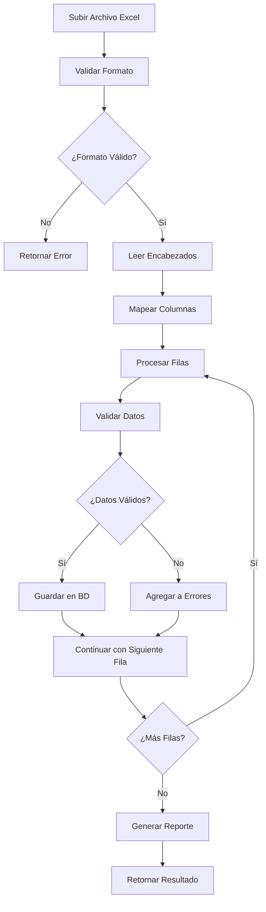

# 📊 Sistema de Importación de Excel

## 🎯 Descripción General

El Sistema de Importación de Excel permite la carga masiva de datos de producción avícola desde archivos Excel (.xlsx/.xls). El sistema incluye mapeo inteligente de columnas, validación de datos, manejo de errores y generación de plantillas automáticas.

## 🏗️ Arquitectura de la Implementación

### Componentes Principales

```
📁 Application/
├── 📄 DTOs/ExcelImportDto.cs
└── 📄 Interfaces/IExcelImportService.cs

📁 Infrastructure/
└── 📄 Services/ExcelImportService.cs

📁 API/
└── 📄 Controllers/ExcelImportController.cs
```

### Dependencias Externas

- **EPPlus**: Librería para lectura/escritura de archivos Excel
- **System.Reflection**: Para mapeo dinámico de propiedades
- **Entity Framework Core**: Para persistencia de datos

## 📋 Funcionalidades Implementadas

### ✅ Importación de Datos
- Carga masiva desde archivos Excel
- Mapeo automático de columnas
- Validación de formato y contenido
- Estadísticas detalladas del proceso

### ✅ Mapeo Inteligente de Columnas
- Reconocimiento de múltiples variaciones de nombres
- Tolerancia a espacios y mayúsculas/minúsculas
- Mapeo configurable por tipo de dato

### ✅ Validación y Manejo de Errores
- Validación por fila individual
- Continuación del proceso ante errores
- Reporte detallado de errores por fila

### ✅ Plantillas Automáticas
- Generación de plantillas Excel
- Encabezados correctos y ejemplos
- Descarga directa desde API

## 🔧 Implementación Técnica

### DTOs Principales

#### `ExcelImportResultDto`
```csharp
public sealed record ExcelImportResultDto(
    bool Success,
    string Message,
    int TotalRowsProcessed,
    int TotalRowsImported,
    int TotalRowsFailed,
    List<string> Errors
);
```

#### `ExcelTemplateInfoDto`
```csharp
public sealed record ExcelTemplateInfoDto(
    string TableName,
    List<string> RequiredColumns,
    List<string> OptionalColumns,
    List<string> AllPossibleHeaders
);
```

### Configuración de EPPlus

```csharp
static ExcelImportService()
{
    // Configurar EPPlus para uso no comercial (EPPlus 8+)
    ExcelPackage.License.SetNonCommercialPersonal("ZooSanMarino");
}
```

### Mapeo de Columnas

El sistema utiliza un mapeo inteligente que reconoce múltiples variaciones:

```csharp
public static class ExcelColumnMappings
{
    private static readonly Dictionary<string, string> ColumnMappings = new()
    {
        // Encabezados reales del Excel -> Propiedades del DTO
        { "AÑOGUÍA", "AnioGuia" },
        { "RAZA", "Raza" },
        { "Edad", "Edad" },
        { "%MortSemH", "MortSemH" },
        { "RetiroAcH", "RetiroAcH" },
        { "%MortSemM", "MortSemM" },
        { "RetiroAcM", "RetiroAcM" },
        { "ConsAcH", "ConsAcH" },
        { "ConsAcM", "ConsAcM" },
        { "GrAveDiaH", "GrAveDiaH" },
        { "GrAveDiaM", "GrAveDiaM" },
        { "PesoH", "PesoH" },
        { "PesoM", "PesoM" },
        { "%Uniform", "Uniformidad" },
        { "HTotalAA", "HTotalAa" },
        { "%Prod", "ProdPorcentaje" },
        { "HIncAA", "HIncAa" },
        { "%AprovSem", "AprovSem" },
        { "PesoHuevo", "PesoHuevo" },
        { "MasaHuevo", "MasaHuevo" },
        { "%Grasa", "GrasaPorcentaje" },
        { "%Nac im", "NacimPorcentaje" },
        { "PollitoAA", "PollitoAa" },
        { "KcalAveDiaH", "KcalAveDiaH" },
        { "KcalAveDiaM", "KcalAveDiaM" },
        { "%AprovAc", "AprovAc" },
        { "GR/HuevoT", "GrHuevoT" },
        { "GR/HuevoInc", "GrHuevoInc" },
        { "GR/Pollito", "GrPollito" },
        { "1000", "Valor1000" },
        { "150", "Valor150" },
        { "%Apareo", "Apareo" },
        { "PesoM/H", "PesoMh" }
    };
}
```

## 📡 Endpoints del API

### 1. Importar Datos de Producción Avícola

```http
POST /api/ExcelImport/produccion-avicola
```

**Parámetros:**
- `file` (IFormFile): Archivo Excel a importar
- `companyId` (int): ID de la compañía (automático desde JWT)

**Ejemplo de Solicitud:**
```bash
curl -X POST "http://localhost:5002/api/ExcelImport/produccion-avicola" \
  -H "Authorization: Bearer {token}" \
  -F "file=@datos_produccion.xlsx"
```

**Respuesta Exitosa:**
```json
{
  "success": true,
  "message": "Importación completada exitosamente",
  "totalRowsProcessed": 150,
  "totalRowsImported": 145,
  "totalRowsFailed": 5,
  "errors": [
    "Fila 23: Valor inválido en columna 'peso_h'",
    "Fila 67: Fecha fuera de rango",
    "Fila 89: Datos insuficientes",
    "Fila 134: Error de formato en 'uniformidad'",
    "Fila 142: Raza no reconocida"
  ]
}
```

### 2. Validar Archivo Excel

```http
POST /api/ExcelImport/validate-produccion-avicola
```

Valida el archivo sin importar los datos.

**Respuesta:**
```json
{
  "success": true,
  "message": "Archivo válido para importación",
  "totalRowsProcessed": 150,
  "totalRowsImported": 0,
  "totalRowsFailed": 5,
  "errors": [
    "Fila 23: Advertencia - Valor vacío en columna opcional"
  ]
}
```

### 3. Información de Plantilla

```http
GET /api/ExcelImport/template-info
```

**Respuesta:**
```json
{
  "tableName": "produccion_avicola_raw",
  "requiredColumns": [
    "AÑOGUÍA",
    "RAZA",
    "Edad"
  ],
  "optionalColumns": [
    "PesoH",
    "PesoM",
    "%Uniform",
    "%Prod",
    "PesoHuevo"
  ],
  "allPossibleHeaders": [
    "AÑOGUÍA",
    "RAZA", 
    "Edad",
    "%MortSemH",
    "RetiroAcH",
    // ... todos los encabezados soportados
  ]
}
```

### 4. Descargar Plantilla Excel

```http
GET /api/ExcelImport/download-template
```

**Respuesta:** Archivo Excel binario con:
- Encabezados correctos en la primera fila
- Fila de ejemplo con datos de muestra
- Formato listo para completar y subir

## 📊 Proceso de Importación

### Flujo Completo



### Validaciones Aplicadas

#### 1. **Validación de Archivo**
```csharp
private (bool IsValid, List<string> Errors) ValidateFile(IFormFile file)
{
    var errors = new List<string>();

    if (file == null)
        errors.Add("No se ha proporcionado ningún archivo.");

    if (file.Length == 0)
        errors.Add("El archivo está vacío.");

    if (file.Length > 10 * 1024 * 1024) // 10 MB
        errors.Add("El archivo es demasiado grande (máximo 10 MB).");

    var allowedExtensions = new[] { ".xlsx", ".xls" };
    var extension = Path.GetExtension(file.FileName).ToLowerInvariant();
    if (!allowedExtensions.Contains(extension))
        errors.Add("Formato de archivo no soportado. Use .xlsx o .xls");

    return (errors.Count == 0, errors);
}
```

#### 2. **Validación de Estructura**
- Verificación de encabezados en primera fila
- Mapeo de columnas conocidas
- Detección de columnas faltantes críticas

#### 3. **Validación de Datos por Fila**
- Verificación de tipos de datos
- Validación de rangos numéricos
- Comprobación de valores requeridos

## 🔧 Configuración y Personalización

### Agregar Nuevos Mapeos de Columnas

Para agregar soporte para nuevos encabezados:

```csharp
// En ExcelColumnMappings
private static readonly Dictionary<string, string> ColumnMappings = new()
{
    // Mapeos existentes...
    { "Nuevo Encabezado", "NuevaPropiedad" },
    { "Another Header", "OtraPropiedad" }
};
```

### Configurar Validaciones Personalizadas

```csharp
private bool ValidateCustomData(string value, string columnName)
{
    return columnName switch
    {
        "Raza" => ValidateRaza(value),
        "Edad" => ValidateEdad(value),
        "PesoH" => ValidatePeso(value),
        _ => true
    };
}
```

## 📈 Manejo de Errores y Logging

### Tipos de Errores

#### 1. **Errores de Archivo**
- Archivo no proporcionado
- Formato no soportado
- Tamaño excesivo
- Archivo corrupto

#### 2. **Errores de Estructura**
- Encabezados faltantes
- Hoja de cálculo vacía
- Formato de encabezados incorrecto

#### 3. **Errores de Datos**
- Valores fuera de rango
- Tipos de datos incorrectos
- Campos requeridos vacíos
- Datos duplicados

### Estrategia de Manejo

```csharp
// Continuar procesando ante errores individuales
try
{
    var createDto = ProcessRow(worksheet, row, columnMapping);
    if (createDto != null)
    {
        var result = await _produccionService.CreateAsync(createDto);
        importedData.Add(result);
        processedRows++;
    }
}
catch (Exception ex)
{
    errors.Add($"Fila {row}: {ex.Message}");
    errorRows++;
    // Continuar con la siguiente fila
}
```

## 🚀 Mejores Prácticas de Uso

### 1. **Preparación del Archivo Excel**

#### Estructura Recomendada:
```
| AÑOGUÍA | RAZA     | Edad | PesoH | PesoM | %Uniform |
|---------|----------|------|-------|-------|----------|
| 2024    | Cobb 500 | 42   | 2.1   | 2.8   | 85       |
| 2024    | Ross 308 | 38   | 2.0   | 2.7   | 87       |
```

#### Consejos:
- ✅ Usar la primera fila para encabezados
- ✅ Evitar celdas combinadas
- ✅ Mantener formato consistente
- ✅ Usar números sin formato especial
- ❌ No incluir fórmulas complejas
- ❌ No usar colores como datos

### 2. **Validación Previa**

Siempre validar antes de importar:

```javascript
// 1. Validar primero
const validation = await fetch('/api/ExcelImport/validate-produccion-avicola', {
  method: 'POST',
  body: formData
});

const validationResult = await validation.json();

if (validationResult.success) {
  // 2. Proceder con importación
  const import = await fetch('/api/ExcelImport/produccion-avicola', {
    method: 'POST', 
    body: formData
  });
}
```

### 3. **Manejo de Resultados**

```javascript
const result = await response.json();

console.log(`Procesadas: ${result.totalRowsProcessed}`);
console.log(`Importadas: ${result.totalRowsImported}`);
console.log(`Errores: ${result.totalRowsFailed}`);

if (result.errors.length > 0) {
  console.log('Errores encontrados:');
  result.errors.forEach(error => console.log(`- ${error}`));
}
```

## 🔒 Seguridad y Limitaciones

### Limitaciones de Archivo
- **Tamaño máximo**: 10 MB
- **Formatos soportados**: .xlsx, .xls
- **Filas máximas**: Sin límite específico (limitado por memoria)

### Seguridad
- **Autenticación JWT**: Requerida en todos los endpoints
- **Multi-tenant**: Datos asociados automáticamente al CompanyId
- **Validación de entrada**: Sanitización de datos de Excel
- **Límites de rate**: Configurables por endpoint

### Consideraciones de Performance
- **Procesamiento por lotes**: Optimizado para archivos grandes
- **Transacciones**: Cada fila se procesa independientemente
- **Memoria**: Liberación automática de recursos Excel

---

**Implementado**: Octubre 2024  
**Versión**: 1.0.0  
**Dependencias**: EPPlus 8+, Entity Framework Core  
**Formatos soportados**: .xlsx, .xls
