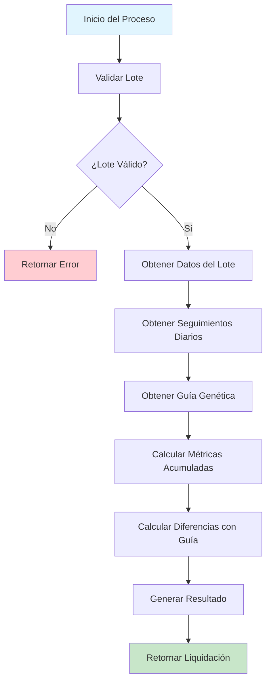

# 🔄 Flujo de Liquidación Técnica - Proceso Completo

## 🎯 Descripción del Proceso

El flujo de liquidación técnica es un proceso automatizado que calcula todas las métricas necesarias para el cierre de lotes de levante a la semana 25. Este documento describe el proceso completo paso a paso, desde la preparación de datos hasta la generación de reportes.

## 📋 Proceso General

### Diagrama de Flujo Completo



## 🔍 Fase 1: Validación y Preparación

### 1.1 Validación del Lote

**Objetivo:** Verificar que el lote existe y tiene datos suficientes para el cálculo.

**Criterios de Validación:**
- ✅ Lote existe en la base de datos
- ✅ Lote pertenece a la compañía del usuario
- ✅ Lote no está marcado como eliminado
- ✅ Lote tiene fecha de encaset
- ✅ Lote tiene aves encasetadas (hembras o machos > 0)
- ✅ Existen registros de seguimiento diario

**Código de Validación:**
```csharp
public async Task<bool> ValidarLoteParaLiquidacionAsync(string loteId)
{
    // Verificar existencia del lote
    var loteExiste = await _context.Lotes
        .Where(l => l.LoteId == loteId && 
                   l.CompanyId == _currentUser.CompanyId && 
                   l.DeletedAt == null)
        .AnyAsync();

    if (!loteExiste) return false;

    // Verificar datos de seguimiento
    var tieneSeguimiento = await _context.SeguimientoLoteLevante
        .Where(s => s.LoteId == loteId)
        .AnyAsync();

    return tieneSeguimiento;
}
```

### 1.2 Obtención de Datos Base

**Datos del Lote:**
```sql
SELECT 
    LoteId, LoteNombre, FechaEncaset, Raza, 
    AnoTablaGenetica, CodigoGuiaGenetica,
    HembrasL, MachosL, AvesEncasetadas
FROM Lotes 
WHERE LoteId = @loteId 
  AND CompanyId = @companyId 
  AND DeletedAt IS NULL
```

**Registros de Seguimiento:**
```sql
SELECT 
    FechaRegistro, MortalidadHembras, MortalidadMachos,
    SelH, SelM, ErrorSexajeHembras, ErrorSexajeMachos,
    ConsumoKgHembras, ConsumoKgMachos,
    PesoPromH, PesoPromM, UniformidadH, UniformidadM
FROM SeguimientoLoteLevante 
WHERE LoteId = @loteId
  AND FechaRegistro <= @fechaLimite
ORDER BY FechaRegistro
```

## 📊 Fase 2: Cálculos de Métricas

### 2.1 Métricas de Mortalidad

**Fórmula:**
```
% Mortalidad = (Total Mortalidad Acumulada / Aves Iniciales) × 100
```

**Implementación:**
```csharp
private decimal CalcularPorcentajeMortalidad(int totalMortalidad, int avesIniciales)
{
    if (avesIniciales == 0) return 0;
    return (decimal)totalMortalidad / avesIniciales * 100;
}

// Aplicación
var totalMortalidadH = seguimientos.Sum(s => s.MortalidadHembras);
var totalMortalidadM = seguimientos.Sum(s => s.MortalidadMachos);

var porcMortalidadH = CalcularPorcentajeMortalidad(totalMortalidadH, lote.HembrasL ?? 0);
var porcMortalidadM = CalcularPorcentajeMortalidad(totalMortalidadM, lote.MachosL ?? 0);
```

### 2.2 Métricas de Selección

**Fórmula:**
```
% Selección = (Total Selección Acumulada / Aves Iniciales) × 100
```

**Implementación:**
```csharp
var totalSeleccionH = seguimientos.Sum(s => s.SelH);
var totalSeleccionM = seguimientos.Sum(s => s.SelM);

var porcSeleccionH = CalcularPorcentaje(totalSeleccionH, lote.HembrasL ?? 0);
var porcSeleccionM = CalcularPorcentaje(totalSeleccionM, lote.MachosL ?? 0);
```

### 2.3 Métricas de Error de Sexaje

**Fórmula:**
```
% Error Sexaje = (Total Error Sexaje Acumulado / Aves Iniciales) × 100
```

**Implementación:**
```csharp
var totalErrorH = seguimientos.Sum(s => s.ErrorSexajeHembras);
var totalErrorM = seguimientos.Sum(s => s.ErrorSexajeMachos);

var porcErrorH = CalcularPorcentaje(totalErrorH, lote.HembrasL ?? 0);
var porcErrorM = CalcularPorcentaje(totalErrorM, lote.MachosL ?? 0);
```

### 2.4 Retiro Total Acumulado

**Fórmula:**
```
% Retiro Total = % Mortalidad + % Selección + % Error Sexaje
```

**Implementación:**
```csharp
var porcRetiroH = porcMortalidadH + porcSeleccionH + porcErrorH;
var porcRetiroM = porcMortalidadM + porcSeleccionM + porcErrorM;

// Retiro general (todas las aves)
var totalAves = (lote.HembrasL ?? 0) + (lote.MachosL ?? 0);
var totalRetiros = totalMortalidadH + totalMortalidadM + 
                   totalSeleccionH + totalSeleccionM + 
                   totalErrorH + totalErrorM;

var porcRetiroGeneral = totalAves > 0 ? 
    (decimal)totalRetiros / totalAves * 100 : 0;
```

### 2.5 Consumo de Alimentos

**Fórmula:**
```
Consumo Total (gramos) = Σ(ConsumoKgHembras + ConsumoKgMachos) × 1000
```

**Implementación:**
```csharp
var consumoTotalKg = seguimientos.Sum(s => 
    s.ConsumoKgHembras + (s.ConsumoKgMachos ?? 0));
var consumoTotalGramos = consumoTotalKg * 1000; // Convertir a gramos
```

### 2.6 Peso y Uniformidad Final

**Obtención de Datos Finales:**
```csharp
var ultimoSeguimiento = seguimientos
    .OrderBy(s => s.FechaRegistro)
    .LastOrDefault();

var pesoFinalH = ultimoSeguimiento?.PesoPromH;
var pesoFinalM = ultimoSeguimiento?.PesoPromM;
var uniformidadFinalH = ultimoSeguimiento?.UniformidadH;
var uniformidadFinalM = ultimoSeguimiento?.UniformidadM;
```

## 🔍 Fase 3: Comparación con Guía Genética

### 3.1 Obtención de Datos de Guía

**Criterios de Búsqueda:**
- Misma raza del lote
- Mismo año de tabla genética
- Edad = 175 días (semana 25)

**Consulta:**
```sql
SELECT AnioGuia, Raza, Edad, PesoH, PesoM, 
       Uniformidad, ConsAcH, RetiroAcH
FROM ProduccionAvicolaRaw
WHERE CompanyId = @companyId
  AND DeletedAt IS NULL
  AND Raza = @raza
  AND AnioGuia = @anoTablaGenetica
  AND Edad = '175'
```

### 3.2 Cálculo de Diferencias Porcentuales

**Fórmula General:**
```
% Diferencia = ((Valor Real - Valor Guía) / Valor Guía) × 100
```

**Implementación:**
```csharp
private static decimal? CalcularDiferenciaPorcentual(decimal? valorReal, decimal? valorGuia)
{
    if (!valorReal.HasValue || !valorGuia.HasValue || valorGuia.Value == 0)
        return null;

    return ((valorReal.Value - valorGuia.Value) / valorGuia.Value) * 100;
}

// Aplicación
var difConsumo = CalcularDiferenciaPorcentual(consumoReal, consumoGuia);
var difPesoH = CalcularDiferenciaPorcentual(pesoRealH, pesoGuiaH);
var difPesoM = CalcularDiferenciaPorcentual(pesoRealM, pesoGuiaM);
var difUniformidadH = CalcularDiferenciaPorcentual(uniformidadRealH, uniformidadGuiaH);
```

## 📈 Fase 4: Generación de Resultados

### 4.1 Construcción del DTO de Respuesta

```csharp
return new LiquidacionTecnicaDto(
    // Información básica del lote
    lote.LoteId,
    lote.LoteNombre,
    lote.FechaEncaset ?? DateTime.MinValue,
    lote.Raza,
    lote.AnoTablaGenetica,
    lote.CodigoGuiaGenetica,
    
    // Datos iniciales
    lote.HembrasL,
    lote.MachosL,
    lote.AvesEncasetadas,
    
    // Métricas calculadas
    porcMortalidadH, porcMortalidadM,
    porcSeleccionH, porcSeleccionM,
    porcErrorH, porcErrorM,
    porcRetiroH, porcRetiroM, porcRetiroGeneral,
    
    // Datos de guía y comparaciones
    retiroGuia,
    consumoTotalGramos, consumoGuia, difConsumo,
    pesoFinalH, pesoFinalM, pesoGuiaH, pesoGuiaM, difPesoH, difPesoM,
    uniformidadFinalH, uniformidadFinalM, uniformidadGuiaH, uniformidadGuiaM, 
    difUniformidadH, difUniformidadM,
    
    // Metadatos
    DateTime.UtcNow,
    seguimientos.Count,
    seguimientos.LastOrDefault()?.FechaRegistro
);
```

## 🚀 Casos de Uso Prácticos

### Caso 1: Liquidación Estándar

**Escenario:** Calcular liquidación de un lote al final de la semana 25.

**Pasos:**
1. **Validar lote:** `GET /api/LiquidacionTecnica/L001/validar`
2. **Calcular liquidación:** `GET /api/LiquidacionTecnica/L001`
3. **Procesar resultados**

**Ejemplo de Implementación:**
```javascript
async function calcularLiquidacionEstandar(loteId) {
    try {
        // 1. Validar lote
        const validacion = await fetch(`/api/LiquidacionTecnica/${loteId}/validar`, {
            headers: { 'Authorization': `Bearer ${token}` }
        });
        
        const { esValido } = await validacion.json();
        
        if (!esValido) {
            throw new Error('Lote no válido para liquidación');
        }
        
        // 2. Calcular liquidación
        const response = await fetch(`/api/LiquidacionTecnica/${loteId}`, {
            headers: { 'Authorization': `Bearer ${token}` }
        });
        
        const liquidacion = await response.json();
        
        // 3. Procesar resultados
        console.log(`Lote: ${liquidacion.loteNombre}`);
        console.log(`Retiro Total: ${liquidacion.porcentajeRetiroTotalGeneral.toFixed(2)}%`);
        console.log(`Diferencia Peso H: ${liquidacion.porcentajeDiferenciaPesoHembras?.toFixed(2)}%`);
        
        return liquidacion;
        
    } catch (error) {
        console.error('Error en liquidación:', error);
        throw error;
    }
}
```

### Caso 2: Liquidación con Fecha Específica

**Escenario:** Calcular liquidación hasta una fecha determinada (no necesariamente semana 25).

**Implementación:**
```javascript
async function calcularLiquidacionConFecha(loteId, fechaHasta) {
    const response = await fetch(
        `/api/LiquidacionTecnica/${loteId}?fechaHasta=${fechaHasta}`,
        {
            headers: { 'Authorization': `Bearer ${token}` }
        }
    );
    
    return await response.json();
}

// Uso
const liquidacion = await calcularLiquidacionConFecha('L001', '2024-09-15');
```

### Caso 3: Análisis Detallado con Seguimiento

**Escenario:** Obtener liquidación completa con detalles del seguimiento diario para análisis profundo.

**Implementación:**
```javascript
async function analisisDetalladoLote(loteId) {
    const response = await fetch(`/api/LiquidacionTecnica/${loteId}/completa`, {
        headers: { 'Authorization': `Bearer ${token}` }
    });
    
    const { liquidacion, detalleSeguimiento, datosGuia } = await response.json();
    
    // Análisis de tendencias
    const tendenciaMortalidad = analizarTendencia(
        detalleSeguimiento.map(d => d.mortalidadHembras + d.mortalidadMachos)
    );
    
    // Comparación con guía
    const desviacionPeso = liquidacion.porcentajeDiferenciaPesoHembras;
    
    return {
        liquidacion,
        tendenciaMortalidad,
        desviacionPeso,
        totalSemanas: Math.max(...detalleSeguimiento.map(d => d.semana))
    };
}
```

### Caso 4: Procesamiento por Lotes

**Escenario:** Calcular liquidación para múltiples lotes de manera eficiente.

**Implementación:**
```javascript
async function procesarMultiplesLotes(loteIds) {
    // 1. Validar todos los lotes
    const validaciones = await fetch('/api/LiquidacionTecnica/validar-multiples', {
        method: 'POST',
        headers: {
            'Authorization': `Bearer ${token}`,
            'Content-Type': 'application/json'
        },
        body: JSON.stringify(loteIds)
    });
    
    const { resultados } = await validaciones.json();
    const lotesValidos = resultados
        .filter(r => r.esValido)
        .map(r => r.loteId);
    
    // 2. Procesar lotes válidos en paralelo
    const liquidaciones = await Promise.all(
        lotesValidos.map(loteId => 
            fetch(`/api/LiquidacionTecnica/${loteId}`, {
                headers: { 'Authorization': `Bearer ${token}` }
            }).then(r => r.json())
        )
    );
    
    // 3. Generar resumen
    const resumen = {
        totalLotes: loteIds.length,
        lotesValidos: lotesValidos.length,
        promedioRetiro: liquidaciones.reduce((sum, l) => 
            sum + l.porcentajeRetiroTotalGeneral, 0) / liquidaciones.length,
        liquidaciones
    };
    
    return resumen;
}
```

## 📊 Interpretación de Resultados

### Indicadores Clave de Performance (KPIs)

#### 1. **Retiro Total**
- **Óptimo:** < 5%
- **Aceptable:** 5% - 8%
- **Crítico:** > 8%

#### 2. **Diferencia de Peso vs Guía**
- **Excelente:** > +3%
- **Bueno:** 0% a +3%
- **Deficiente:** < 0%

#### 3. **Uniformidad**
- **Excelente:** > 85%
- **Bueno:** 80% - 85%
- **Deficiente:** < 80%

#### 4. **Eficiencia de Consumo**
- **Eficiente:** Diferencia < +5%
- **Normal:** +5% a +10%
- **Ineficiente:** > +10%

### Ejemplo de Análisis

```javascript
function analizarResultados(liquidacion) {
    const analisis = {
        retiro: clasificarRetiro(liquidacion.porcentajeRetiroTotalGeneral),
        peso: clasificarPeso(liquidacion.porcentajeDiferenciaPesoHembras),
        uniformidad: clasificarUniformidad(liquidacion.uniformidadRealHembras),
        consumo: clasificarConsumo(liquidacion.porcentajeDiferenciaConsumo)
    };
    
    const puntuacion = calcularPuntuacionGeneral(analisis);
    
    return {
        ...analisis,
        puntuacionGeneral: puntuacion,
        recomendaciones: generarRecomendaciones(analisis)
    };
}
```

## ⚠️ Consideraciones Especiales

### Limitaciones del Sistema

1. **Datos Faltantes:**
   - Si no hay guía genética, las comparaciones serán null
   - Registros de seguimiento incompletos afectan la precisión

2. **Fechas Límite:**
   - Máximo 175 días (25 semanas) desde encaset
   - Fechas futuras no son procesadas

3. **Precisión de Cálculos:**
   - Los porcentajes se calculan con precisión decimal
   - Redondeo puede aplicarse en la presentación

### Manejo de Errores

```csharp
try
{
    var liquidacion = await _service.CalcularLiquidacionAsync(request);
    return Ok(liquidacion);
}
catch (InvalidOperationException ex)
{
    _logger.LogWarning("Error de validación: {Error}", ex.Message);
    return BadRequest(new { error = ex.Message });
}
catch (Exception ex)
{
    _logger.LogError(ex, "Error interno en liquidación");
    return StatusCode(500, new { error = "Error interno del servidor" });
}
```

---

**Implementado:** Octubre 2024  
**Proceso:** Automatizado con validaciones  
**Tiempo de ejecución:** < 5 segundos por lote  
**Precisión:** Cálculos con precisión decimal
