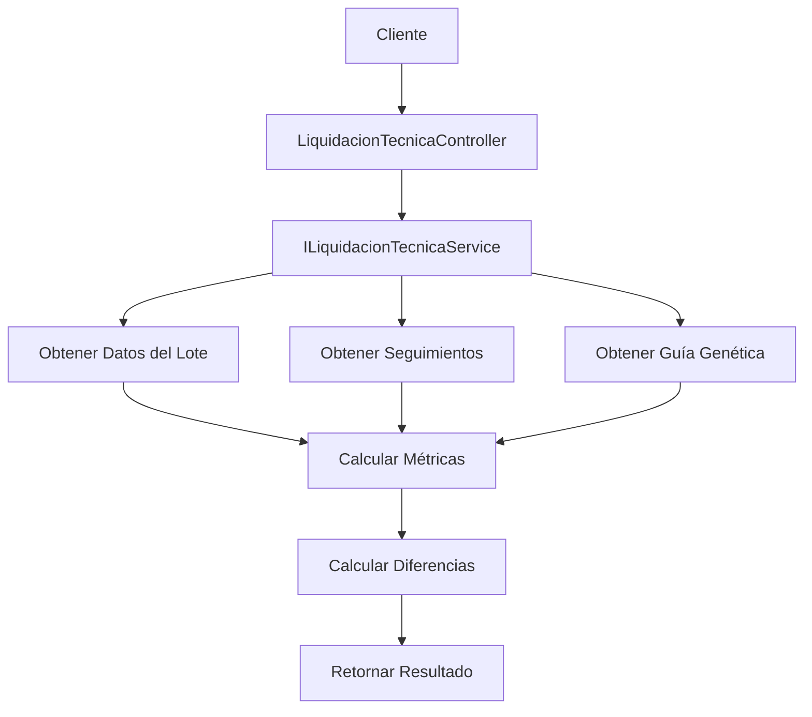

# 📊 Sistema de Liquidación Técnica

## 🎯 Descripción General

El Sistema de Liquidación Técnica es una funcionalidad avanzada que calcula automáticamente todas las métricas necesarias para el cierre o liquidación técnica de lotes de levante a la semana 25. Este sistema integra datos reales del seguimiento diario con datos de guías genéticas para proporcionar análisis comparativos completos.

## 🏗️ Arquitectura de la Implementación

### Componentes Principales

```
📁 Application/
├── 📄 DTOs/LiquidacionTecnicaDto.cs
└── 📄 Interfaces/ILiquidacionTecnicaService.cs

📁 Infrastructure/
└── 📄 Services/LiquidacionTecnicaService.cs

📁 API/
└── 📄 Controllers/LiquidacionTecnicaController.cs
```

### Flujo de Datos



## 📋 Cálculos Implementados

### Variables Acumuladas a la Semana 25

#### 1. **Datos Iniciales**
- ✅ Número total de aves hembras encasetadas
- ✅ Número total de aves machos encasetadas
- ✅ Total de aves encasetadas

#### 2. **Mortalidad Acumulada**
```csharp
// Fórmula implementada
PorcentajeMortalidad = (TotalMortalidad / AvesIniciales) * 100
```
- ✅ % Mortalidad acumulado hembras
- ✅ % Mortalidad acumulado machos

#### 3. **Selección Acumulada**
```csharp
// Fórmula implementada
PorcentajeSeleccion = (TotalSeleccion / AvesIniciales) * 100
```
- ✅ % Selección de hembras acumulado
- ✅ % Selección de machos acumulado

#### 4. **Error de Sexaje Acumulado**
```csharp
// Fórmula implementada
PorcentajeErrorSexaje = (TotalErrorSexaje / AvesIniciales) * 100
```
- ✅ % Error de Sexaje de Hembras Acumulado
- ✅ % Error de Sexaje de Machos Acumulado

#### 5. **Retiro Total Acumulado**
```csharp
// Fórmula implementada
PorcentajeRetiroTotal = PorcentajeMortalidad + PorcentajeSeleccion + PorcentajeErrorSexaje
```
- ✅ % Retiro acumulado hembras (suma mortalidad + selección + error)
- ✅ % Retiro acumulado machos (suma mortalidad + selección + error)
- ✅ % Retiro acumulado general

#### 6. **Consumo de Alimentos**
```csharp
// Conversión a gramos
ConsumoTotalGramos = SumaConsumoKg * 1000
```
- ✅ Consumo de alimentos en gramos acumulados real
- ✅ Consumo de alimentos en gramos acumulados guía
- ✅ % diferencia consumo real vs consumo guía

#### 7. **Peso a la Semana 25**
```csharp
// Diferencia porcentual
DiferenciaPeso = ((PesoReal - PesoGuia) / PesoGuia) * 100
```
- ✅ Peso a la semana 25 real (hembras y machos)
- ✅ Peso a la semana 25 guía (hembras y machos)
- ✅ % diferencial peso real / peso guía

#### 8. **Uniformidad**
```csharp
// Diferencia porcentual
DiferenciaUniformidad = ((UniformidadReal - UniformidadGuia) / UniformidadGuia) * 100
```
- ✅ Uniformidad real (hembras y machos)
- ✅ Uniformidad guía (hembras y machos)
- ✅ % diferencial uniformidad real / uniformidad guía

## 🔧 Implementación Técnica

### DTOs Principales

#### `LiquidacionTecnicaDto`
```csharp
public record LiquidacionTecnicaDto(
    string LoteId,
    string LoteNombre,
    DateTime FechaEncaset,
    string? Raza,
    int? AnoTablaGenetica,
    
    // Datos iniciales
    int? HembrasEncasetadas,
    int? MachosEncasetados,
    int? TotalAvesEncasetadas,
    
    // Mortalidad, Selección, Error de Sexaje
    decimal PorcentajeMortalidadHembras,
    decimal PorcentajeMortalidadMachos,
    decimal PorcentajeSeleccionHembras,
    decimal PorcentajeSeleccionMachos,
    decimal PorcentajeErrorSexajeHembras,
    decimal PorcentajeErrorSexajeMachos,
    
    // Retiro Total
    decimal PorcentajeRetiroTotalHembras,
    decimal PorcentajeRetiroTotalMachos,
    decimal PorcentajeRetiroTotalGeneral,
    
    // Consumo y comparaciones
    decimal ConsumoAlimentoRealGramos,
    decimal? ConsumoAlimentoGuiaGramos,
    decimal? PorcentajeDiferenciaConsumo,
    
    // Peso y comparaciones
    decimal? PesoSemana25RealHembras,
    decimal? PesoSemana25RealMachos,
    decimal? PesoSemana25GuiaHembras,
    decimal? PesoSemana25GuiaMachos,
    decimal? PorcentajeDiferenciaPesoHembras,
    decimal? PorcentajeDiferenciaPesoMachos,
    
    // Uniformidad y comparaciones
    decimal? UniformidadRealHembras,
    decimal? UniformidadRealMachos,
    decimal? UniformidadGuiaHembras,
    decimal? UniformidadGuiaMachos,
    decimal? PorcentajeDiferenciaUniformidadHembras,
    decimal? PorcentajeDiferenciaUniformidadMachos,
    
    // Metadatos
    DateTime FechaCalculo,
    int TotalRegistrosSeguimiento,
    DateTime? FechaUltimoSeguimiento
);
```

### Métodos del Servicio

#### `CalcularLiquidacionAsync`
Calcula la liquidación técnica básica de un lote.

#### `ObtenerLiquidacionCompletaAsync`
Obtiene la liquidación técnica con detalles del seguimiento diario.

#### `ValidarLoteParaLiquidacionAsync`
Verifica si un lote puede ser procesado para liquidación.

## 📡 Endpoints del API

### 1. Liquidación Básica
```http
GET /api/LiquidacionTecnica/{loteId}?fechaHasta=2024-10-02
```

**Parámetros:**
- `loteId` (string): ID del lote a procesar
- `fechaHasta` (DateTime, opcional): Fecha límite para el cálculo

**Respuesta:**
```json
{
  "loteId": "L001",
  "loteNombre": "Lote Ejemplo",
  "fechaEncaset": "2024-03-01T00:00:00Z",
  "raza": "Cobb 500",
  "anoTablaGenetica": 2024,
  "hembrasEncasetadas": 5000,
  "machosEncasetados": 500,
  "totalAvesEncasetadas": 5500,
  "porcentajeMortalidadHembras": 3.2,
  "porcentajeMortalidadMachos": 4.1,
  "porcentajeSeleccionHembras": 2.1,
  "porcentajeSeleccionMachos": 1.8,
  "porcentajeErrorSexajeHembras": 0.5,
  "porcentajeErrorSexajeMachos": 0.3,
  "porcentajeRetiroTotalHembras": 5.8,
  "porcentajeRetiroTotalMachos": 6.2,
  "porcentajeRetiroTotalGeneral": 5.9,
  "porcentajeRetiroGuia": 5.0,
  "consumoAlimentoRealGramos": 125000,
  "consumoAlimentoGuiaGramos": 120000,
  "porcentajeDiferenciaConsumo": 4.17,
  "pesoSemana25RealHembras": 2.1,
  "pesoSemana25GuiaHembras": 2.0,
  "porcentajeDiferenciaPesoHembras": 5.0,
  "uniformidadRealHembras": 85.5,
  "uniformidadGuiaHembras": 88.0,
  "porcentajeDiferenciaUniformidadHembras": -2.84,
  "fechaCalculo": "2024-10-02T00:00:00Z",
  "totalRegistrosSeguimiento": 175,
  "fechaUltimoSeguimiento": "2024-09-30T00:00:00Z"
}
```

### 2. Liquidación Completa
```http
GET /api/LiquidacionTecnica/{loteId}/completa?fechaHasta=2024-10-02
```

**Respuesta:** Incluye la liquidación básica más:
```json
{
  "liquidacion": { /* LiquidacionTecnicaDto */ },
  "detalleSeguimiento": [
    {
      "fecha": "2024-03-01T00:00:00Z",
      "semana": 1,
      "mortalidadHembras": 5,
      "mortalidadMachos": 2,
      "seleccionHembras": 3,
      "seleccionMachos": 1,
      "errorSexajeHembras": 0,
      "errorSexajeMachos": 1,
      "consumoKgHembras": 150.5,
      "consumoKgMachos": 15.2,
      "pesoPromHembras": 0.045,
      "pesoPromMachos": 0.048,
      "uniformidadHembras": 92.5,
      "uniformidadMachos": 90.8
    }
  ],
  "datosGuia": {
    "anioGuia": "2024",
    "raza": "Cobb 500",
    "edad": "175",
    "pesoHembras": 2.0,
    "pesoMachos": 2.8,
    "uniformidad": 88.0,
    "consumoAcumulado": 120000,
    "porcentajeRetiro": 5.0
  }
}
```

### 3. Validación de Lote
```http
GET /api/LiquidacionTecnica/{loteId}/validar
```

**Respuesta:**
```json
{
  "loteId": "L001",
  "esValido": true,
  "mensaje": "Lote válido para liquidación"
}
```

### 4. Cálculo por POST
```http
POST /api/LiquidacionTecnica/calcular
Content-Type: application/json

{
  "loteId": "L001",
  "fechaHasta": "2024-10-02T00:00:00Z"
}
```

### 5. Validación Múltiple
```http
POST /api/LiquidacionTecnica/validar-multiples
Content-Type: application/json

["L001", "L002", "L003"]
```

**Respuesta:**
```json
{
  "total": 3,
  "validos": 2,
  "resultados": [
    { "loteId": "L001", "esValido": true },
    { "loteId": "L002", "esValido": true },
    { "loteId": "L003", "esValido": false }
  ]
}
```

## 🔒 Seguridad y Validaciones

### Autenticación
- **JWT Required**: Todos los endpoints requieren autenticación
- **Multi-tenant**: Automáticamente filtra por `CompanyId`

### Validaciones
- **Existencia del Lote**: Verifica que el lote exista y pertenezca a la compañía
- **Datos de Seguimiento**: Confirma que existan registros de seguimiento
- **Fechas Válidas**: Valida rangos de fechas y límites de semana 25

### Manejo de Errores
```json
// Error 400 - Bad Request
{
  "error": "Lote 'L999' no encontrado o no pertenece a la compañía."
}

// Error 500 - Internal Server Error
{
  "error": "Error interno del servidor"
}
```

## 📊 Fuentes de Datos

### Tablas Principales
1. **`Lotes`**: Datos básicos del lote (aves encasetadas, fechas, raza)
2. **`SeguimientoLoteLevante`**: Registros diarios de seguimiento
3. **`ProduccionAvicolaRaw`**: Datos de guías genéticas para comparación

### Criterios de Filtrado
- **Semana 25**: Máximo 175 días desde fecha de encaset
- **CompanyId**: Seguridad multi-tenant
- **DeletedAt**: Solo registros activos

## 🚀 Casos de Uso

### Caso 1: Liquidación Estándar
```bash
# Obtener liquidación de un lote específico
curl -H "Authorization: Bearer {token}" \
     "http://localhost:5002/api/LiquidacionTecnica/L001"
```

### Caso 2: Liquidación con Fecha Específica
```bash
# Liquidación hasta una fecha determinada
curl -H "Authorization: Bearer {token}" \
     "http://localhost:5002/api/LiquidacionTecnica/L001?fechaHasta=2024-09-15"
```

### Caso 3: Análisis Detallado
```bash
# Obtener liquidación completa con seguimiento diario
curl -H "Authorization: Bearer {token}" \
     "http://localhost:5002/api/LiquidacionTecnica/L001/completa"
```

## 🔧 Configuración y Dependencias

### Registro en DI Container
```csharp
// Program.cs
builder.Services.AddScoped<ILiquidacionTecnicaService, LiquidacionTecnicaService>();
```

### Dependencias del Servicio
- `ZooSanMarinoContext`: Acceso a base de datos
- `ICurrentUser`: Información del usuario actual y compañía

## 📈 Métricas y Performance

### Optimizaciones Implementadas
- **AsNoTracking()**: Consultas de solo lectura
- **Consultas Específicas**: Solo campos necesarios
- **Filtrado Temprano**: Aplicación de filtros en BD

### Consideraciones de Performance
- **Volumen de Datos**: Optimizado para lotes con hasta 25 semanas de seguimiento
- **Caching**: Considerar implementar cache para guías genéticas frecuentes
- **Paginación**: No aplicable (resultado único por lote)

---

**Implementado**: Octubre 2024  
**Versión**: 1.0.0  
**Autor**: Sistema ZooSanMarino
